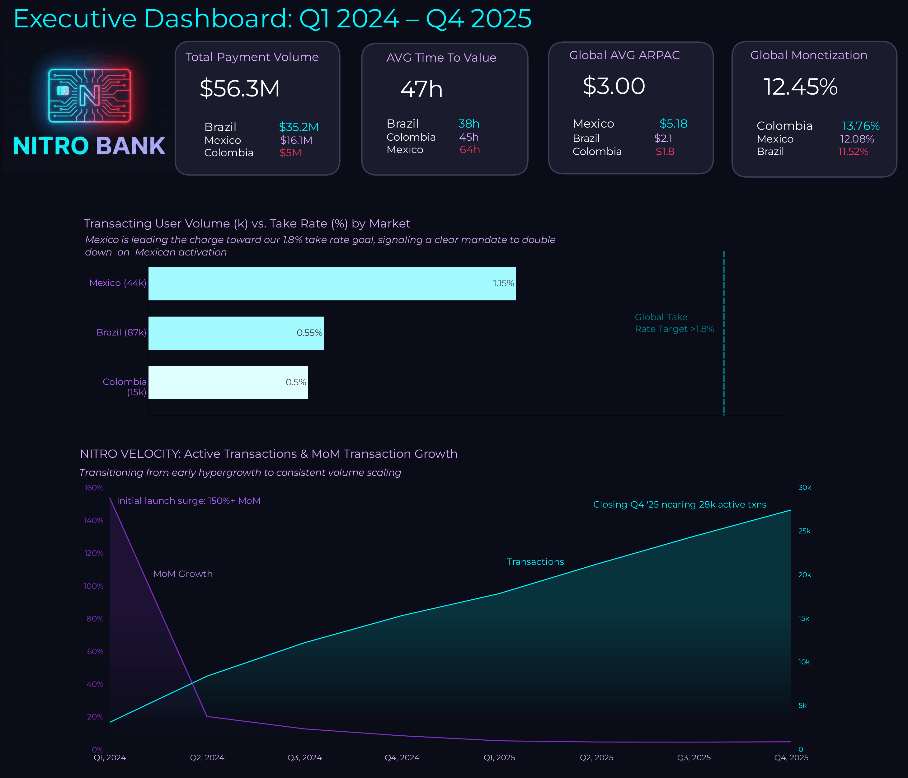

# NitroBank-LATAM-01-Strategic-Audit

**NOTE:** This is a comprehensive portfolio project utilizing a simulated enterprise dataset. The metrics, company names, and financial figures were constructed to demonstrate production-grade Analytics Engineering, Medallion Architecture, and business-focused data modeling.

* **Core Stack:** Databricks SQL (Delta Lake), Python, Looker Studio
* **Architecture:** Medallion (Bronze / Silver / Gold), ELT, Liquid Clustering

### 📑 Table of Contents
* [Executive Summary & Business Impact](#executive-summary)
  * [Data Architecture & Scope](#data-architecture)
* [Part 1: Growth and Acquisition](#part-1-growth-and-acquisition)
* [Part 2: Unit Economics & Profitability](#part-2-unit-economics--profitability)
* [Part 3: Transaction Success & Friction Removal](#part-3-transaction-success--friction-removal)
* [🔧 Analytics Engineering & Architecture](#analytics-engineering)

---

## Executive Summary & Business Impact

This strategic audit evaluates the Latin American expansion of **NitroBank**, a rapidly scaling neobank currently serving **Brazil, Mexico, and Colombia**. By analyzing over **1M+ potential users** alongside **145K+ transactions**, this report moves past surface-level volume metrics to identify the technical roadblocks and hidden revenue engines required to dominate the LATAM fintech landscape.

**The Business Problem:** NitroBank is scaling rapidly, but low-margin volume and severe onboarding bottlenecks are compressing overall profitability and artificially starving user acquisition.

**Key Deliverables & Identified ROI:**
* **$0-Spend Growth Unlock:** Diagnosed a 67% KYC technical drop-off, outlining a recovery strategy to trigger explosive acquisition without additional ad spend.
* **Profitability Pivot:** Identified Mexico as the true economic engine (1.15% Take Rate) and recommended ring-fencing paid acquisition budgets to capture its $5.18 ARPAC.
* **Credit Revenue Generation:** Framed 89.2% of transaction declines (Insufficient Funds) as a micro-credit opportunity, proposing "Nitro Reserve" to transition from a digital wallet to a highly profitable, full-service bank.

### 📊 The Executive Dashboard
*(A static view of the final metrics compiled from the Gold Layer. Click the image to view the full resolution).*

### Data Architecture & Scope

The audit was carried out following a **Medallion Architecture**. The ERD below represents the **Silver Layer**, which serves as the cleaned, relational source of truth. 

 

**Audit Scale & Data Volume:**
* **`silver_events` (fact table):** 1.62M+ web event records processed (representing 1.05M unique users), capturing interactions, device specs, and marketing attribution.
* **`silver_users` (dimension table):** 450K+ unique registered accounts analyzed across all active regions.
* **`silver_transactions` (fact table):** 145K+ transaction records processed, tracking payment volume, approval rates, and decline triggers.

---

# Part 1: Growth and Acquisition

### The Divide: Elite Retention vs. Onboarding Failure
**Stakeholder:** Head of Growth | **Priority:** 🔴 CRITICAL

**📊 Key Metrics:**
* **The KYC Wall:** 67% drop-off (~301,500 users) at Document Submission.
* **Elite Retention:** 90.3% of users fund their accounts once clearing the KYC wall.
* **Top-of-Funnel Contrast:** Colombia yields a 50.1% organic signup rate but only a 13.8% monetization rate.

**Insight:** NitroBank has exceptional product-market fit, but a single operational bottleneck is trapping massive revenue. A universal 67% drop-off at Document Submission across all regions points to a severe technical crash (likely an Android Camera SDK loop) rather than localized trust issues, artificially starving our user acquisition. 🔗 **[Access SQL Queries](Analytics_Engineering/Part1_Gold_Layer_Funnel.sql)**

 

**Strategic Action:**
1. **Technical Sprint:** Isolate KYC module timeouts and crashes by Device Model and Network Type to solve for LATAM's volatile mobile data environments.
2. **Incentive Restructuring:** Move the reward trigger from "KYC Completion" to "First Account Funding," replacing generic USD offers with psychologically substantial, localized tiers.
3. **Gated Recovery:** Deploy an A/B recovery campaign to the 301,500 "stuck" users *only* after confirming the SDK UI crashes are resolved.

**Business Impact:** Optimizing our onboarding to an industry-standard 60% completion rate triggers explosive bottom-up growth with **$0 in additional marketing spend.**

---

# Part 2: Unit Economics & Profitability

### The Profitability Paradox & The "Trust Gap"
**Stakeholder:** CFO & Head of Strategy | **Priority:** 🟠 HIGH

**📊 Key Metrics:**
* **Total Payment Volume (TPV):** $56.3M processed globally.
* **The Engine (Mexico):** 1.15% Take Rate and $5.18 Average Revenue Per Active Customer (ARPAC).
* **The Trap (Colombia):** 0.50% Take Rate (lowest global margin).
* **The Trust Gap:** Mexican users exhibit a critical 60.8-hour Time-to-Value lag (2.5 days to first deposit).

**Insight:** Volume does not inherently equal profit. While Colombia drives high user intent, scaling there compresses margins. Mexico is our true economic engine, but Mexican users suffer a 2.5-day activation delay, proving they hesitate to deposit until they have vetted the platform’s reliability. 🔗 **[Access SQL Queries](Analytics_Engineering/Part_2.gold_fact_financials_monthly.sql)**

 

**Strategic Action:**
1. **Bridge the Trust Gap:** Launch a "Day 1 Funding Match" in Mexico (e.g., deposit $10, get $2) to pull forward initial deposits and collapse the 60.8-hour activation delay.
2. **Subsidize "The Whales":** Increase referral bonuses by 50%. The elite unit economics of this channel will easily absorb the higher CAC.
3. **Ring-Fence Ad Spend:** Shift paid marketing away from Colombia (moving to organic-led) and aggressively reallocate the Facebook Ad budget exclusively to Mexican acquisition to capture the $5.31 ARPAC.

**Business Impact:** Maximizes sustainable profit margins by pivoting Customer Acquisition Cost (CAC) directly toward high-LTV regions and high-value referral channels.

---

# Part 3: Transaction Success & Friction Removal

### From Declines to Credit Revenue
**Stakeholder:** Head of Product | **Priority:** 🟠 HIGH

**📊 Key Metrics:**
* **Approval Rate:** 89.36% in Mexico (mirroring Brazil/Colombia stability).
* **Decline Volume:** 15,296 total failed transactions.
* **The Liquidity Wall:** 89.2% of failures (13,649 transactions) were solely due to *Insufficient Funds*.

**Insight:** High margins in Mexico are built on sustainable behavior, proven by a stable ~10.5% global decline rate. More importantly, an "Insufficient Funds" decline is a highly qualified lead—users are at the point of sale, ready to transact. By failing to provide instant liquidity, NitroBank misses out on interchange fees and interest-bearing revenue. 🔗 **[Access SQL Queries](Analytics_Engineering/PART_3_Transaction_Success_and_Friction_Removal.sql)**

 

**Strategic Action:** Deploy "Nitro Reserve" via a propensity-driven credit framework:
1. **Mexico (Trust Bridge):** Deploy a $25 USD credit-builder card to users trapped in the 60.8-hour Time-To-Value lag, converting hesitation into funded accounts.
2. **Brazil (Collateralized Liquidity):** Utilize historical vault activity as a behavioral proxy to offer "Limite Garantido," clearing transaction declines with zero systemic default risk.
3. **Colombia (Organic Beta):** Deploy instant, low-value "Nanocredito" lifelines to cover minor checkout shortfalls to prioritize high-loyalty retention.

**Business Impact:** Converting just 20% of "Insufficient Funds" declines instantly boosts active TPV and transforms NitroBank from a low-margin digital wallet into a highly profitable, full-service bank.

---

# 🔧 Analytics Engineering & Architecture

While this portfolio utilizes static SQL scripts to demonstrate the underlying business logic, the pipeline is engineered following **production-grade ELT** design principles. The core focus is on defensive data modeling, strict data quality enforcement, and **compute cost optimization** to build a trustworthy and efficient Medallion architecture. 🔗 **[Access SQL Queries](Analytics_Engineering/Bronze_to_Silver_Transition.sql)**

 

### 1. Data Observability & Quality Assurance
Raw mobile telemetry is inherently chaotic. To protect downstream analytics from webhook retry storms and client-side clock skew, I developed a suite of diagnostic SQL guardrails that act as automated data quality expectations before data ever reaches the Silver layer. 🔗 **[Access SQL Queries](Analytics_Engineering/Data_Quality_Dashboard.sql)**

* **Technical Integrity Enforcement:** Strictly validates primary key uniqueness to flag technical duplicates, while simultaneously enforcing chronological validity to neutralize "time-traveling" events and verify funnel completeness.
* **Risk & Anomaly Detection:** Deployed a Bot Velocity Check to identify high-velocity KYC completions (<30s), flagging potential fraudulent actors before they contaminate business metrics.

 

### 2. The Silver Layer: FinOps & Processing (Bronze ➔ Silver)
* **Deterministic Lineage:** Generated MD5 surrogate keys (user + event + timestamp) to guarantee 100% traceability for raw, ID-less telemetry.
* **FinOps & Compute Optimization:** Deployed **Databricks Liquid Clustering** on frequently filtered dimensions (`country`, `event_name`, `event_timestamp`). This enables adaptive, aggressive data skipping that slashes query latency and minimizes cloud compute costs for downstream Looker Studio reporting.
* **Precision Deduplication:** Deployed single-pass `QUALIFY ROW_NUMBER() = 1` logic to strip technical duplicates and filter anomalies flagged by the QA dashboard. 

> **Production Consideration: Data Quarantine Strategy**
> *In this portfolio simulation, the Silver layer aggressively deduplicates records using `QUALIFY ROW_NUMBER() = 1` to optimize compute. In a live enterprise deployment, I would implement a **Quarantine Pattern**. Instead of silently dropping structural fractures, those records would be routed to a `silver_quarantine` table. This ensures 100% Source-to-Warehouse row count reconciliation for financial auditors, while keeping the primary Silver tables pristine for LTV modeling.*

### 3. Strategic Data Modeling: Eliminating Survivorship Bias (Silver ➔ Gold)
* **The "Ghost User" Solution:** Engineered a Denormalized Star Schema to capture the 67% of traffic that drops off pre-registration, persisting Country and Marketing Source directly on the `silver_events` fact table.
* **Zero-Join BI Analysis:** Empowered **Looker Studio executive dashboards** to analyze unregistered traffic directly from the fact table. This slashes BI query latency and bypasses the compute costs of expensive distributed joins.

### 4. The Gold Layer: Financial Integrity & Evolution (Business Aggregates)
* **State Machine Enforcement:** Embedded logic to strictly enforce the irreversible sequential flow (KYC → Activation → Spend). Timeline checks guarantee chronological consistency so no spending occurs before account creation.
* **Audit-Grade Financial Hardening:** Designed the architecture to support dynamic `LEFT JOIN`s on a `dim_exchange_rates` table. Joining on `currency_code` and `DATE(transaction_timestamp)` allows historical purchases to be parsed against daily market rates, providing point-in-time auditability for regulatory compliance.
* **Reconciliation Audit:** Achieved a <0.02% variance during cross-layer validation between the tracking table and the core database, ensuring dashboard metrics map 100% to known entities.
