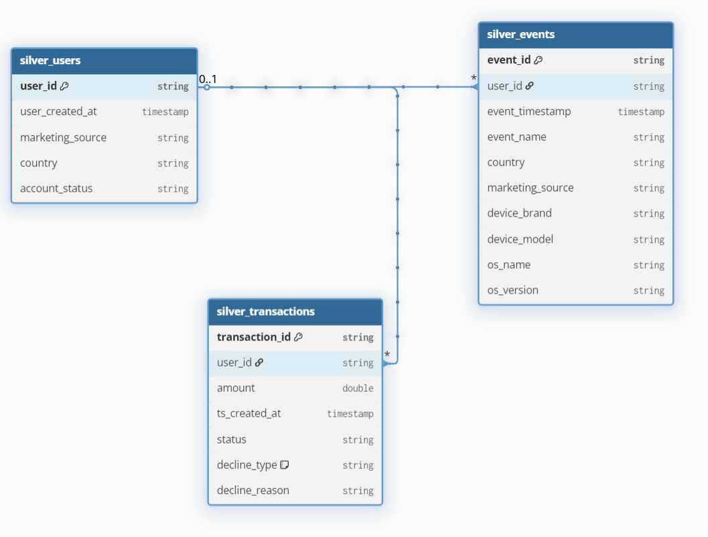
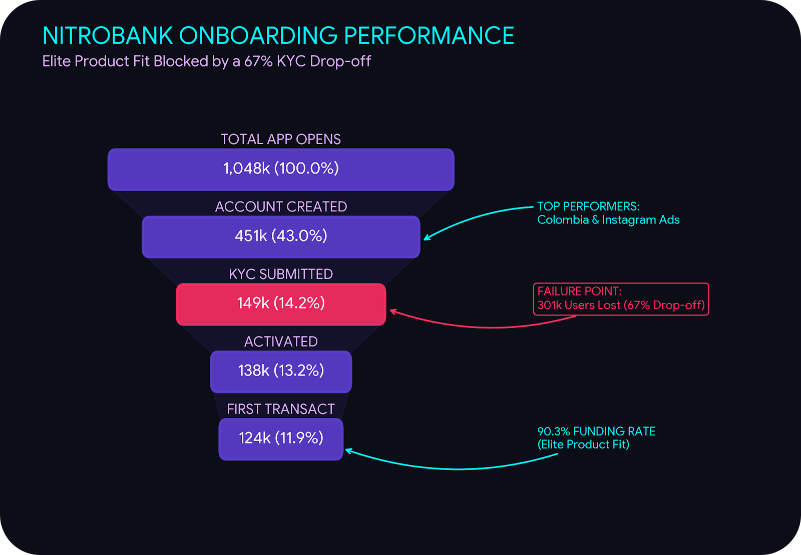
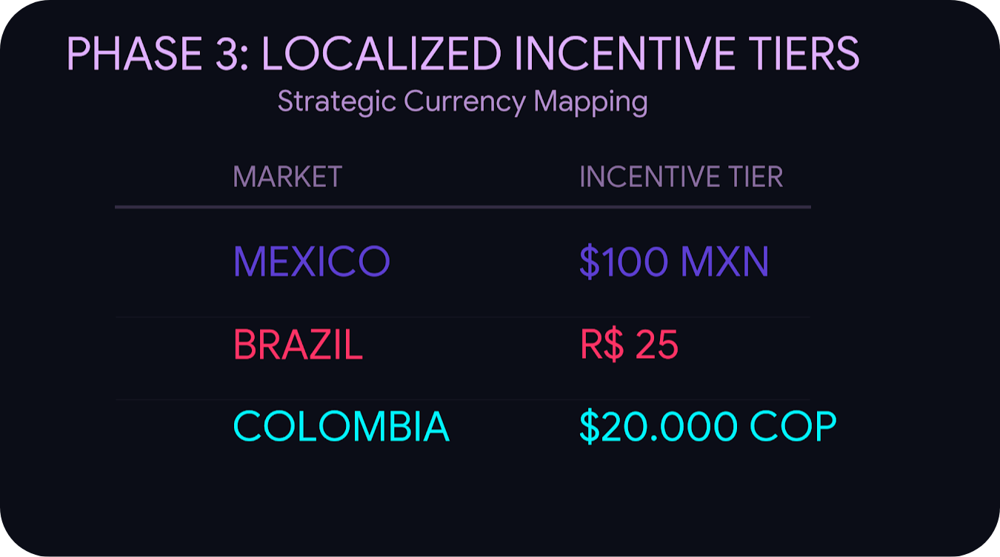
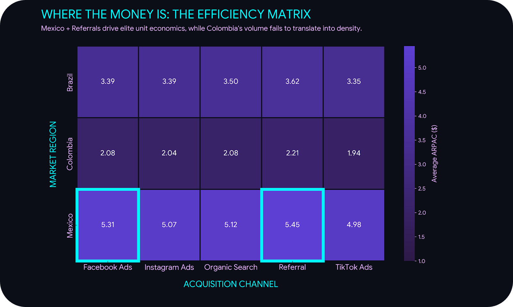
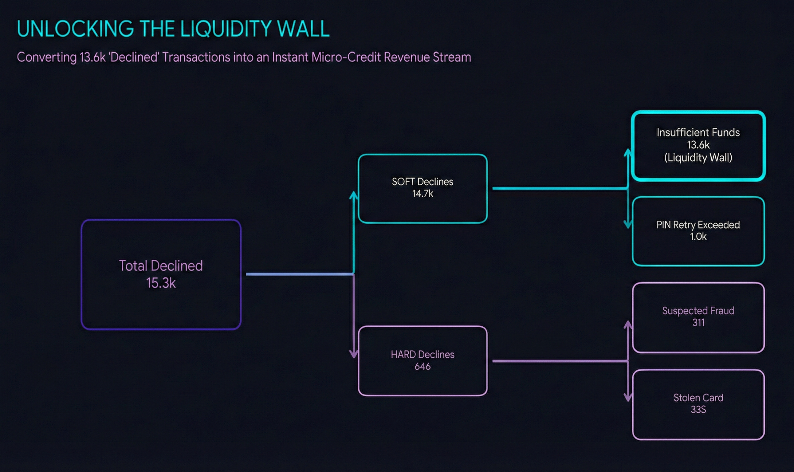
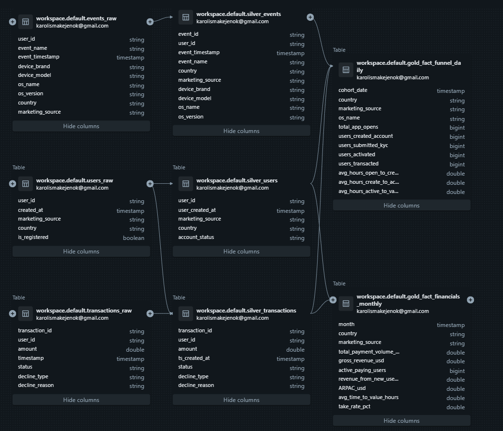
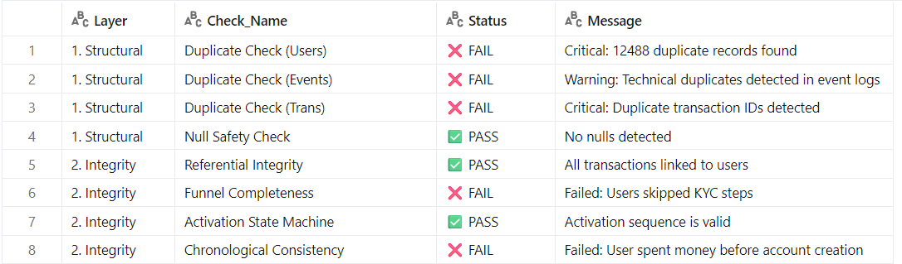

# NitroBank-LATAM-Fintech-Growth-Audit 

> **📊 [Access the Live Looker Studio Executive Dashboard Here](insert_your_looker_link_here)**

### 📑 Table of Contents
* [Executive Summary](#executive-summary)
  * [Data Architecture & Scope](#data-architecture--scope)
  * [Audit Scale & Data Volume](#audit-scale--data-volume)
* [Part 1: Growth and Acquisition](#part-1-growth-and-acquisition)
  * [1. Retention vs. Onboarding Failure](#1-the-divide-elite-retention-vs-onboarding-failure)
  * [2. Strategic Diagnosis: The DROP-OFF](#2-strategic-diagnosis-the-drop-off)
  * [3. Action Plan: Growth](#3-action-plan)
* [Part 2: Unit Economics & Profitability](#part-2-unit-economics--profitability)
  * [1. The Profitability Paradox](#1-the-profitability-paradox)
  * [2. Rethinking LTV vs. CAC](#2-strategic-analysis-rethinking-ltv-vs-cac)
  * [3. Action Plan: Profitability](#3-recommended-action-plan)
* [Part 3: Transaction Success & Friction](#part-3-transaction-success--friction-removal)
  * [1. Stability & The Liquidity Wall](#1-the-data-story-stability--the-liquidity-wall)
  * [2. From Declines to Revenue](#2-strategic-analysis-from-declines-to-revenue)
  * [3. Action Plan: Friction Removal](#3-recommended-action-plan-1)
* [🔧 Analytics Engineering & Architecture](#-analytics-engineering--architecture)
  * [1. Data Quality Assurance: The Engineering Dashboard](#1-data-quality-assurance-the-engineering-dashboard)
  * [2. The Silver Layer: Performance & Lineage](#2-the-silver-layer-performance--lineage)
  * [3. Strategic Modelling: Eliminating Survivorship Bias](#3-strategic-modelling-eliminating-survivorship-bias)
  * [4. The Gold Layer: Financial Integrity & Evolution](#4-the-gold-layer-financial-integrity--evolution)
## Executive Summary 

  

Commissioned by executive leadership to evaluate **NitroBank**’s expansion across Latin America, this strategic audit identifies the critical bottlenecks and financial drivers dictating our regional success. By analyzing **over 1 million potential users across Brazil, Mexico, and Colombia** alongside extensive transactional telemetry (January 2024–January 2026), we have isolated specific opportunities to optimize operational efficiency and maximize profitability. The findings and recommended actions are structured across three core areas:
  

* **Part 1: Growth & Acquisition:** A diagnostic breakdown of top-of-funnel conversion, identifying a 67% Document Submission "Wall" and the $0 marketing-spend opportunity to unlock explosive user growth by resolving technical KYC crashes to recover 301,500 "stuck" users. 

* **Part 2: Unit Economics & Profitability:** An analysis of the "Profitability Paradox," shifting strategy away from low-margin volume toward Mexico’s elite **1.15% Take Rate** and high-LTV referral channels. 

* **Part 3: Transaction Success & Friction Removal:** A deep dive into **>145,000 transactions** to validate market stability and transform "Insufficient Funds" declines into a high-margin micro-credit product line. 

  

**Strategic Imperative:** By repairing the KYC ingestion pipeline, pivoting acquisition to Mexico's high-yield segments, and monetizing declined transactions through a new micro-credit product, NitroBank can immediately transition from a low-margin "wallet" into a highly profitable, full-service digital bank. 

  

### Data Architecture & Scope 

  
The audit was carried out following a **Medallion Architecture**. The Entity Relationship Diagram (ERD) below represents the **Silver Layer**, which serves as the cleaned, relational source of truth. Full **Medallion Transformation** flow and **Directed Acyclic Graph (DAG)** can be accessed in [🔧 Analytics Engineering & Architecture part.](#-analytics-engineering--architecture) 

 

  

### Audit Scale & Data Volume 

  

* **silver_events** (fact table): **1.62M+** event records processed, capturing detailed user interactions, device specifications, and marketing attribution. 

* **silver_users** (dimension table): **450K+** unique registered accounts analyzed across all active regions to track onboarding and retention. 

* **silver_transactions** (fact table): **145K+** transaction records processed, tracking payment volume, approval rates, and decline triggers. 

  

## Part 1: Growth and Acquisition 

  

*[Access the Gold Layer SQL Pipeline used to generate these funnel insights](Analytics_Engineering/Part1_Gold_Layer_Funnel.sql)* 

  

### 1. The Divide: Elite Retention vs. Onboarding Failure 

  

NitroBank has an exceptional product-market fit, but a single operational bottleneck is trapping massive, zero-CAC revenue. Optimizing our onboarding to an industry-standard 60% completion rate will trigger explosive bottom-up growth with **$0 in additional marketing spend.** 

  

* **The KYC Wall:** We are losing **67%** of our acquired leads (~301,500) precisely at Document Submission. 

* **Elite Retention:** The intent is there. Once users clear that KYC wall, a staggering **90.3%** fund their accounts almost immediately. 

* **Top-of-Funnel Inefficiency:** We are currently subsidizing high-bounce traffic on Facebook Ads globally (27.9% signup rate) while under-leveraging top-of-funnel conversion winners like Instagram Ads (53.6%) and Organic Search (50.2%). However, **acquisition cost is only half the equation.** Before aggressively cutting the Facebook budget, we must map these specific acquisition channels to downstream user behaviour to ensure we aren't accidentally cutting off a low-converting but high-spending demographic. 

* **The "Hidden Gem":** Colombia drives our lowest traffic volume but yields top-tier intent (50.1% signup rate) and our highest Global Monetization Rate (13.8%), making it prime for scaled top-of-funnel investment. 

  

 

  

### 2. Strategic Diagnosis: The DROP-OFF 

  

* **Ruling Out Culture & Psychology:** The KYC drop-off is practically identical across Brazil (33.1%), Mexico (33.2%), and Colombia (33.0%). High-intent organic users fail at the same rate. This is definitively not a localized trust or motivation issue. 

* **The Primary Suspect (Technical Failure):** With an overwhelmingly Android user base (e.g., 523k Android vs. 105k iOS in Brazil), this universal failure points to a severe technical crash—likely an Android Camera SDK or UI loop during document upload. 

* **The Telemetry Blind Spot:** A cohort of ~32,000 "Unknown OS" users boasts a 100% Signup Rate and a staggering **26.8% Monetization Rate** (vs. Android's 11.6%). This signals bypassed telemetry (likely Web-to-App handoffs or API partners) and represents a highly profitable untapped channel. 

  

### 3. Action plan 

  

**Phase 1: The Technical "Fix It" Sprint (Days 1–7)** 

* **Crash Telemetry Audit:** Isolate KYC module timeouts and crashes by **Device Model, OS, and Network Type** to solve for LATAM's volatile mobile data environments. 

* **Granular Funnel Tracking:** Implement screen-by-screen drop-off logs (ID Front/Back/Selfie) and monitor **"Activation Lag"** to pinpoint the exact friction point in the Android SDK. 

  

**Phase 2: Data-Driven Marketing Reallocation** 

* **LTV Validation:** Before diverting the **Facebook Ads budget** (27.9% signup) to Instagram or Organic, map cohort-specific **Take Rates** and **LTV** to ensure we aren't cutting a low-converting but high-spending demographic. 

* **Conditional Shift:** Transition spend only once high-value profitability is confirmed in alternative channels. 

  

**Phase 3: The Activation & Recovery Campaign** 

* **Incentive Restructuring:** Move the reward trigger from "KYC Completion" to **"First Account Funding"** to protect the ROI baseline and ensure revenue-generating behaviour. 

* **Correct the ROI Baseline:** Do not assume the 90.3% organic funding rate will apply to an incentivized cohort. Users motivated by cash bonuses inherently show higher immediate churn and lower long-term funding rates. 

* **Deploy Localized Tiers & Messaging:** Replace the generic $5 USD offer with localized, psychologically round numbers (in the Spanish or Portuguese if the account was created in these languages) that feel native and substantial in each market: 

  

 

  

* **Gated A/B Testing:** Deploy a recovery campaign to the **301,500 "Stuck" users**. It is critical to maintain a strict hold on this spend until Phase 1 validates that the technical UI crashes are resolved. 

  

### 4. Looking Ahead: Bridging To Part 2 

  

While fixing the KYC bottleneck resolves the volume equation, user acquisition means nothing without profitability. Part 2 shifts from funnel volume to financial health, analysing Total Payment Volume (TPV), Take Rates, and Average Revenue Per Active Customer (ARPAC) to validate NitroBank's true economic engines in LATAM. 

  

## Part 2: Unit Economics & Profitability 

  

*[Access Monthly Financials Gold Layer SQL queries](Analytics_Engineering/Part_2.gold_fact_financials_monthly.sql)* 

  

Volume does not inherently equal profit. While Part 1 identified how to recover 301,000+ users, an analysis of **$56.3M in Total Payment Volume (TPV)** reveals that the "conversion gem" (Colombia) is actually our weakest revenue generator. To maximize NitroBank's financial health, we must pivot toward Mexico, our true economic engine, which boasts a **1.15% Take Rate** and an **ARPAC of $5.18**—more than double any other market. 

  

### 1. The Profitability Paradox 

  

* **The Mexican Efficiency:** Mexico processes less than half the volume of Brazil ($16.1M vs. $35.2M TPV) but generates significantly higher margins. Its 1.15% Take Rate makes it the most efficient market in the portfolio. 

* **The Whale Channel (Referrals):** Referral users are harder to acquire but hold the highest ARPAC ($3.76) and the fastest Time to Value (45.7 hours). They are our most lucrative and loyal user base. 

* **The Colombia Trap:** Despite high user intent, Colombia is a low-margin environment with only a 0.50% Take Rate. Scaling here without better interchange fees will compress overall profit margins. 

* **The Mexican Trust Gap:** Despite being our most profitable demographic, Mexican users exhibit a critical 60.8-hour Time To Value lag—nearly double Brazil’s 38 hours. Since Mexico’s SPEI network provides 24/7 instantaneous settlement, this 2.5-day delay is a UX and psychological failure rather than a technical one. This "Trust Gap" confirms that while Mexican users have high intent, they are hesitating to deposit their first dollar until they have vetted the platform’s reliability. 

  

### 2. Strategic Analysis: Rethinking LTV vs. CAC 

  

* **The Geo-Arbitrage Opportunity:** Mexico’s $5.18 ARPAC (2.5x Colombia’s) justifies a significantly higher Customer Acquisition Cost (CAC) while maintaining highly profitable unit economics. 

* **Channel-Specific Unit Economics:** Though globally inefficient, Facebook Ads are a localized goldmine in Mexico, yielding an elite $5.31 ARPAC (second only to Referrals). We must ring-fence our Facebook budget exclusively for Mexican acquisition. However, before deployment, we must calculate the exact CAC for this specific segment to verify the $5.31 ARPAC supports a sustainable, profitable LTV:CAC margin at scale. 

  

 

  

### 3. Recommended Action Plan 

  

**Phase 1: The Mexican Activation Sprint** 

To capture Mexico's high-ARPAC revenue faster, we must pivot from technical fixes to trust-building interventions. The objective is to collapse the 60.8-hour activation lag and convert user hesitation into funded accounts. 

* **Trust Intervention:** Deploy Mexico-specific onboarding cues to directly address the 2.5-day trust gap. 

* **Incentivize Speed:** Launch a "Day 1 Funding Match" (e.g., deposit $10, get $2) to pull forward initial deposits and establish immediate Time-to-Value (TTV). 

  

**Phase 2: The Referral Overhaul** 

* **Subsidize "The Whales":** Increase the referral bonus payout by 50%. The elite unit economics of this channel will easily absorb the higher CAC, driving faster acquisition of high-spending, high-intent users. 

  

**Phase 3: Strategic Pivot in Colombia** 

* **Pause Paid Hyper-Growth:** Shift Colombia entirely to a product-led organic strategy. Aggressive ad spend will not yield venture-scale returns until we negotiate better local interchange fees to lift the baseline 0.50% Take Rate. 

  

### 4. Looking Ahead: The Risk Factor 

  

While Mexico’s **1.15% Take Rate** is our primary economic driver, unusually high margins in emerging markets often signal underlying financial risk. Part 3 will analyze transaction declines and behavioral proxies to determine if these margins are sustainable, or if we are inadvertently taking on toxic volume. 

  

## Part 3: Transaction Success & Friction Removal 

*[Access Transaction Analysis SQL queries](Analytics_Engineering/PART_3_Transaction_Success_and_Friction_Removal.sql)* 
  

To ensure Mexico’s high profitability was not masking underlying risks, I analysed **>145,000 transactions** across LATAM. The results are definitive: Mexico’s **89.36% Approval Rate** proves our highest-margin market is fundamentally healthy. However, the analysis of **15,296 declines** revealed that **89.2% of failures** are due to *Insufficient Funds*. This transforms a perceived "risk problem" into the perfect launchpad for **NitroBank’s** first credit product: **Nitro Reserve**.

### 1. The Data Story: Stability & The Liquidity Wall 

  

* **Sustainable Margins:** Mexico’s 89.36% Approval Rate mirrors Brazil (89.6%) and Colombia (89.2%), confirming that high margins are built on sustainable user behavior, not excess risk. 

* **Global Security Parity:** A consistent ~10.5% decline rate across three distinct macroeconomic environments proves our fraud telemetry is stable and reliable. 

* **The Liquidity Wall:** 13,649 transactions were blocked solely because wallets were empty. Purchasing intent is currently outpacing user deposits, leaving massive interchange revenue on the table. 

* **The Churn Risk:** Secondary declines like `PIN_RETRY_EXCEEDED` (1,001) and `SUSPECTED_FRAUD` (311) create high-friction "hard blocks" that lead to immediate app abandonment. 

  

 

  

### 2. Strategic Analysis: From Declines to Revenue 

  

* **The Ultimate Qualified Lead:** An "Insufficient Funds" decline is not a prevented loss—it is a highly qualified lead for a credit product. Users are at the point of sale, card in hand, ready to transact. By failing to provide instant liquidity, NitroBank is missing out on both interchange fees and interest-bearing revenue. 

* **The Risk-to-Opportunity Shift:** By converting these failed checkouts into micro-loans, we don't just save a transaction; we deepen the primary bank relationship. This allows NitroBank to move from a basic "Wallet" model into a highly profitable "Full-Service Bank" ecosystem. 

  

### 3. Recommended Action Plan 

  

**Phase 1: Strategic Deployment of "Nitro Reserve"**

Rather than a broad-market rollout to all 13,649 users triggering "Insufficient Funds" declines, NitroBank will implement a **propensity-driven eligibility framework**. By gating credit access behind behavioral signals, we strictly align capital deployment with localized risk profiles and unit economics.

   #### 🇲🇽 Mexico: Bridging the "Trust Gap"
   * **Target Segment:** Users who cleared the KYC "Wall" but remain trapped in the **60.8-hour Time-To-Value (TTV) lag**.
   * **Intervention:** Deploy a **$25 USD (500 MXN) credit-builder card** as a psychological catalyst to convert hesitation into funded accounts.
   * **Objective:** Immediate capture of Mexico’s elite **1.15% Take Rate** and **$5.18 ARPAC** by collapsing the 2.5-day activation delay.

   #### 🇧🇷 Brazil: Collateralized Liquidity
   * **Target Segment:** Users with established **historical vault activity**.
   * **Intervention:** Utilize existing deposits as a behavioral proxy for creditworthiness, offering the **"Limite Garantido"** model to clear transaction declines.
   * **Objective:** Convert Brazil’s massive transaction volume into interest-bearing revenue with **zero systemic default risk**.

   #### 🇨🇴 Colombia: Organic Retention Beta
   * **Target Segment:** Users acquired via **Organic or Referral channels** (boasting a **50.1% signup rate**).
   * **Intervention:** Deploy instant, low-value **"Nanocredito"** lifelines to cover minor checkout shortfalls.
   * **Objective:** Prioritize high-loyalty retention via a low-volume beta, strictly gating aggressive scale until local interchange fees are negotiated above the **0.50% baseline**.
  

**Phase 2: Automated UX Recovery** 

* **Biometric Resets:** For `PIN_RETRY_EXCEEDED`, trigger an immediate push notification with a biometric reset link to seamlessly bypass friction. 

* **Interactive Fraud Alerts:** For `SUSPECTED_FRAUD`, deploy an "Instant Verification" alert so users can verify and retry legitimate transactions rather than suffering a silent block. 

  

### Business Impact & Final Conclusion 

  

* **Immediate Uplift:** Converting just 20% of "Insufficient Funds" declines (~2,700 transactions) via micro-credit instantly boosts active TPV and introduces a lucrative, high-margin interest stream. 

* **The Blueprint:** NitroBank now has a complete, data-backed roadmap: Fix the onboarding "Wall" (Part 1), double down on high-value Mexican acquisition (Part 2), and unlock credit-led growth via transaction recovery (Part 3). 

  

## 🔧 Analytics Engineering & Architecture
*[Access the BRONZE-->SILVER Transition Queries](Analytics_Engineering/Bronze_to_Silver_Transition.sql)*

**Stack:** Databricks SQL (Delta Lake) | ELT | Medallion Architecture | Liquid Clustering | Data Quality Testing | Looker Studio 

> **Architectural Note:** While this portfolio utilizes static SQL scripts to clearly demonstrate the underlying business logic, the pipeline is engineered following **Delta Live Tables (DLT)** design principles. The focus is on defensive data modeling, strict data quality enforcement, and **compute cost optimization** to build a trustworthy and efficient Medallion architecture:

 

### 1. Data Quality Assurance: The Engineering Dashboard

 

> **Data Observability in Action:** Raw mobile telemetry is inherently chaotic. As expected, the inbound Bronze data triggers multiple integrity failures—including webhook retry storms creating duplicate users, and client-side clock skew causing "time-traveling" transactions. This pipeline was built specifically to intercept, quarantine, and neutralize these anomalies before they corrupt downstream analytics.

To protect the integrity of the Silver and Gold layers, I developed a suite of diagnostic SQL guardrails. Serving as a proxy for production DLT Expectations, these tests proactively audit the data across three critical risk vectors:
*[Access the Data Quality Guardrails SQL queries](Analytics_Engineering/Data_Quality_Dashboard.sql)*

### 2. FinOps & Compute Optimization: Liquid Clustering

> **Cost-Conscious Engineering:** In modern cloud data platforms, unoptimized BI queries hitting flat tables will quickly inflate warehouse compute bills. To simulate a production-grade, cost-efficient environment, the Silver layer actively utilizes Databricks Liquid Clustering.

By strategically clustering tables on frequently filtered dimensions (like `country`, `event_name`, and `event_timestamp`), this architecture enables aggressive **data skipping**. This guarantees that downstream Gold layer transformations and end-user Looker Studio dashboards only scan the exact micro-partitions they need, drastically reducing query execution time and overall cloud costs.

* **Layer 1 - Structural:** Validates primary key uniqueness and hunts for technical duplicates in event logs.
* **Layer 2 - Integrity:** Guarantees chronological validity (no "time-traveling" events) and verifies funnel completeness to ensure business logic holds at scale.
* **Layer 3 - Risk & Anomaly:** Implemented a Bot Velocity Check to identify anomalous, high-velocity KYC submissions (completion in <30s), flagging potential fraudulent actors before they contaminate downstream analytics.

### 2. The Silver Layer: Performance & Lineage
* **Precision Deduplication & Quarantine:** To neutralize the anomalies flagged by the QA dashboard, I deployed single-pass `QUALIFY ROW_NUMBER()` logic. This successfully stripped all technical duplicates and strictly filtered out "time-traveling" users, keeping the verified Silver counts perfectly pristine.
* **Deterministic Lineage:** Generated MD5 surrogate keys (user + event + timestamp) to guarantee 100% traceability for raw, ID-less telemetry.
* **Compute Optimization:** Implemented Liquid Clustering to optimize partition pruning and proactively solve the "Small File Problem." *For >10M row datasets, this layer transitions to dbt incremental models to slash warehouse compute costs.*

### 3. Strategic Modelling: Eliminating Survivorship Bias
* **The "Ghost User" Solution:** Engineered a Denormalized Star Schema to capture the 67% of traffic that drops off pre-registration, persisting Country and Marketing Source directly on the `silver_events` fact table.
* **Zero-Join BI Analysis:** Empowered **Looker Studio executive dashboards** to analyze unregistered traffic directly from the fact table. This slashes BI query latency and bypasses the compute costs of expensive distributed joins.

### 4. The Gold Layer: Financial Integrity & Evolution
* **State Machine Enforcement:** Embedded logic to strictly enforce the irreversible sequential flow: KYC → Activation → Spend. Timeline checks guarantee chronological consistency (no spending before account creation).
* **Audit-Grade Financial Hardening:** To transition this simulation to a live banking environment, hardcoded `CASE` statements for currency conversion would be replaced by a dynamic `LEFT JOIN` on a `dim_exchange_rates` table. Joining on `currency_code` and `DATE(transaction_timestamp)` parses historical purchases against daily market rates, providing the point-in-time auditability required for regulatory compliance.
* **Reconciliation Audit:** Achieved a <0.02% variance during cross-layer validation between the Behavioural Funnel (124,498 users) and Transactional Ledger (124,471 users), ensuring dashboard metrics map 100% to known entities.
